Jenkins Server Docker image(`hyperhq/hyperkins`) for Hyper_
=========================================================

Make run Jenkins Server in Hyper_ Cloud easier.

<!-- TOC depthFrom:1 depthTo:6 withLinks:1 updateOnSave:1 orderedList:0 -->

- [Prerequisites](#prerequisites)
- [What's in the image](#whats-in-the-image)
- [Run Jenkins Server container](#run-jenkins-server-container)
	- [QuickStart](#quickstart)
	- [Attach FIP](#attach-fip)
	- [Specify Container Size](#specify-container-size)
	- [Customized Jenkins admin account](#customized-jenkins-admin-account)
	- [Use data volume](#use-data-volume)
	- [Run Jenkins Server in `Production Mode`](#run-jenkins-server-in-production-mode)
- [Access Jenkins Web UI](#access-jenkins-web-ui)
- [Config Jenkins](#config-jenkins)
	- [Ensure for JNLP](#ensure-for-jnlp)
	- [config Hyper_ credential](#config-hyper-credential)
- [Run helloworld job](#run-helloworld-job)
	- [create helloworld job](#create-helloworld-job)
	- [trigger build](#trigger-build)
	- [view result](#view-result)
		- [console output](#console-output)
		- [Slave container info](#slave-container-info)
		- [Slave container log](#slave-container-log)
- [Build `hyperhq/hyperkins` image](#build-hyperhqhyperkins-image)

<!-- /TOC -->

# Prerequisites

- Hyper_ client     [install](https://docs.hyper.sh/GettingStarted/install.html)
  - You should install `Hyper_ client` on your localhost.
- Hyper_ credential [create](https://docs.hyper.sh/GettingStarted/generate_api_credential.html)
  - You should register a Hyper_ account, then create a credential.
- Docker image: `hyperhq/hyperkins`
  - run `hyper pull hyperhq/hyperkins`

# What's in the image

To run Jenkins Server easier in Hyper_, the following items had been installed in image `hyperhq/hyperkins`
(based on `jenkins:latest`)
- hyper client
- `hyper-slaves-plugin` for Jenkins
- recommended Jenkins plugin

> To build `hyperhq/hyperkins`, please see [Build `hyperhq/hyperkins` image](#build-hyperhqhyperkins-image)


# Run Jenkins Server container

Here are examples of run Jenkins Server in Hyper_ Cloud.

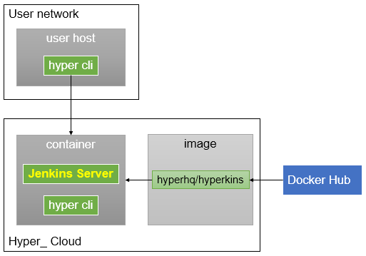

## QuickStart

```
$ hyper run --name jenkins-server-dev \
  -d -P \
  hyperhq/hyperkins
```
- This will run Jenkins Server in `Development` Mode, the `Setup Wizard` will be skipped.
- Option
  - `-d` Run container in background
  - `-P` Publish all exposed ports
    - `8080`: Jenkins Web UI
    - `50000`: JNLP port
- The default `admin account` of Jenkins Web UI is:
  - username: `admin`
  - password: `nimda`

## Attach FIP
To access Jenkins Web UI in your Web Browser, The Hyper_ container requires a `FIP`.
```
$ FIP=`hyper fip allocate 1`
$ hyper fip attach $FIP jenkins-server-dev
```

## Specify Container Size
The default container size is `s4`(`512M`B memory), the recommended size is `m1`(`1GB` memory)
```
$ hyper run --name jenkins-server-dev \
  -d -P \
  --size=m1 \
  hyperhq/hyperkins
```

## Customized Jenkins admin account
You just need specified the environment variables `ADMIN_USERNAME`(default is `admin`) and `ADMIN_PASSWORD`(default is `nimda`).
```
$ hyper run --name jenkins-server-dev \
  -d -P \
  --size=m1 \
  -e ADMIN_USERNAME=root \
  -e ADMIN_PASSWORD=toor \
  hyperhq/hyperkins
```

## Use data volume
```
$ hyper run --name jenkins-server-dev \
  -d -P \
  --size=m1 \
  -e ADMIN_USERNAME=root \
  -e ADMIN_PASSWORD=toor \
  -v jenkins-data-dev:/var/jenkins_home \
  hyperhq/hyperkins
```
> if volume `jenkins-data` isn't exist, it will be created automatically.

## Run Jenkins Server in `Production Mode`

```
$ hyper run --name jenkins-server \
  -d -P \
  --size=m2 \
  -v jenkins-data:/var/jenkins_home \
  -e PRODUCTION=true \
  hyperhq/hyperkins

$ FIP=`hyper fip allocate 1`
$ hyper fip attach $FIP jenkins-server
```
- To run Jenkins Server in Production Mode, just specified environment variable `PRODUCTION` to `true`.
- The recommended size in Production Mode is `m2`(`2GB` memory)
- The default value of `PRODUCTION` is `false`.
- `ADMIN_USERNAME` and `ADMIN_PASSWORD` are ignored.
- In Production Mode, the `Setup Wizard` will occur, and you should use `initialAdminPassword` to Unlock Jenkins.
- There are two ways to get initialAdminPassword
  - run `hyper logs jenkins-server`, to get initialAdminPassword
  - run `hyper exec -it jenkins-server cat /var/jenkins_home/secrets/initialAdminPassword`
- In Production mode, `Enable Slave -> Master Access Control` will be checked
```
(Menu)Manage Jenkins -> Configure Global Security
  -> Enable Slave -> Master Access Control
```
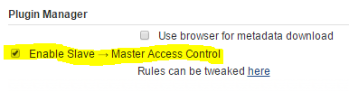

# Access Jenkins Web UI

open `http://$FIP:8080` in Web Browser

- If Jenkins Server runs in Development mode, just login Jenkins Web with admin account.
- If Jenkins Server runs in Production mode, use `initialAdminPassword` to Unlock Jenkins first.


# Config Jenkins

## Ensure for JNLP
JNLP is `enabled` by default in `hyperhq/hyperkins` image
```
(Menu)Manage Jenkins -> Configure Global Security ->
  - Enable security: true
  - TCP port for JNLP agents: Fixed 50000
```
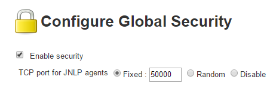

## config Hyper_ credential

You can use the same Hyper_ account to run Slave Node.  
You also can use another Hyper_ account to run Slave Node. [create credential](https://docs.hyper.sh/GettingStarted/generate_api_credential.html)

```
(Menu)Manage Jenkins -> Configure System -> Hyper Config

//Step 1: Input Hyper_ credential
  - Hyper_ Access Key
  - Hyper_ Secret Key

//Step 2: click button "Save credential"

//Step 3: click button "Test connection to Hyper_"
```

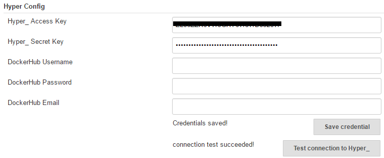


# Run helloworld job

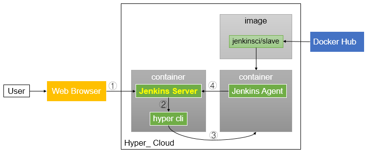

## create helloworld job
```
//Step 1: create "Freestyle project" helloworld

//Step 2: check "Run the build inside Hyper_ container"
   - Docker Image: jenkinsci/slave
   - Container Size: S4
```

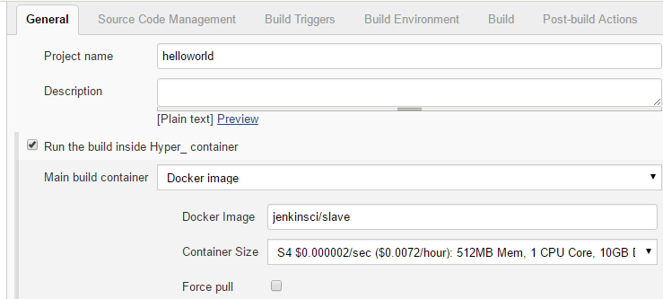

Other tested base images are:
 - openjdk:8-jdk
 - hyperhq/jenkins-slave-centos
 - hyperhq/jenkins-slave-golang:1.7-centos
 - hyperhq/jenkins-slave-golang:1.7-ubuntu

```
//Step 3: Add build step "Execute shell"
  - Command:
```

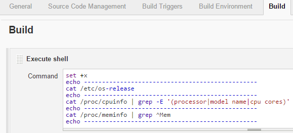  

Here is the shell script:
```
set +x
echo ------------------------------------------------
cat /etc/os-release
echo ------------------------------------------------
cat /proc/cpuinfo | grep -E '(processor|model name|cpu cores)'
echo ------------------------------------------------
cat /proc/meminfo | grep ^Mem
echo ------------------------------------------------
```

## trigger build
Trigger build manually in this demo.
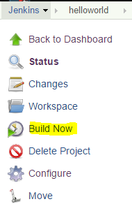

## view result

### console output
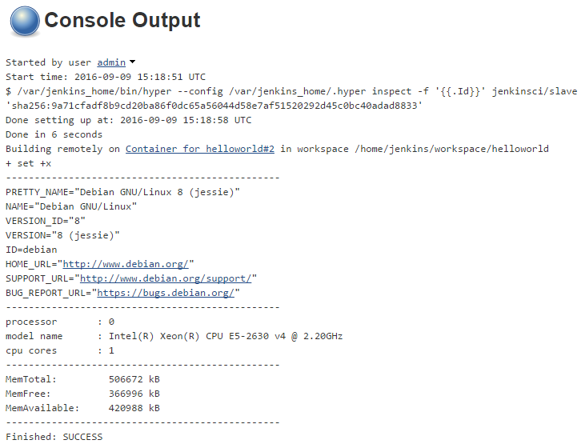

### Slave container info
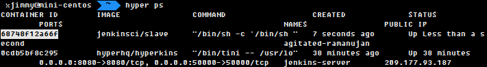

### Slave container log
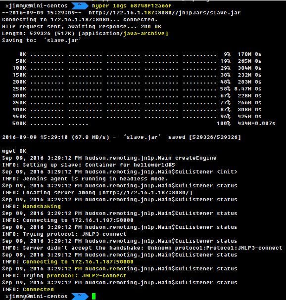


# Build `hyperhq/hyperkins` image

```
$ ./util.sh build
$ ./util.sh push
```
